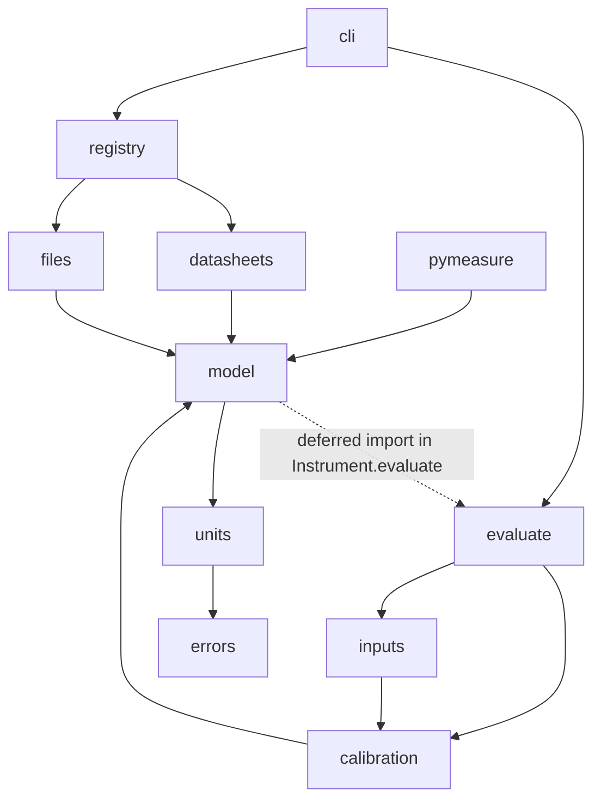
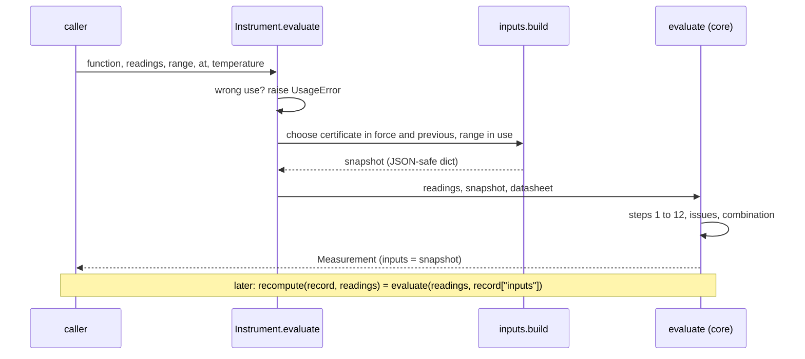

# gumeasure architecture

Status: accepted as the basis for step 1. Choices made without the owner are marked `#todo: check this`.

This document turns the design brief of the owner into a package structure. It fixes the modules, their dependencies, the interfaces between them and the formats that leave the package. It does not repeat the GUM rules of the brief. Section numbers like "brief §5" refer to that brief. The brief is not part of the repository.

Where this document adds to the brief or departs from it, the item has a number and is listed in [section 13](#13-decisions-for-the-owner). A-numbers depart from the brief. D-numbers continue the open decisions D1 to D8 of the brief.

The worked examples E1 to E5 were recomputed with an independent script before this was written. All values agree with the brief within 1e-9 relative. E4 agrees only if the time since calibration is counted in whole days (D9).

The technical claims below were checked against pint 0.25.3, pydantic 2.13.5, numpy 2.4.6 and PyMeasure 0.16.0 on Python 3.11.

---

## 1. Principles

1. **One pure core.** `gumeasure.evaluate(readings, inputs)` is the only code that computes a budget. All other code prepares its arguments or presents its result.
2. **Inputs are a snapshot.** `inputs` holds the numbers the core uses, not references to files. A record stays recomputable when the data sheet file or the certificate file has changed or is gone.
3. **Issues come from the core.** The core finds every issue about the state of the instrument. So `recompute` gives the same issues as the original evaluation.
4. **Quantities at the edges, floats inside.** pint quantities enter and leave at the public interface. The core works on floats in the unit of the function.
5. **Imports point downwards.** A module imports only modules below it in the layer diagram. The core imports no file loading, no registry and no PyMeasure.
6. **One parser for files and Python.** TOML files and Python data sheets build their quantities with the same functions. Equal text gives equal objects.

---

## 2. Modules and layers



| Layer | Module | Holds |
|---|---|---|
| base | `errors.py` | exceptions |
| base | `units.py` | access to the pint registry, quantity parser, `q()` and `frac()`, dimension checks |
| domain | `model.py` | dataclasses of brief §3, issue table, linear half-width formula |
| core | `calibration.py` | choice of certificate and interval, interpolation, drift, certificate check |
| core | `inputs.py` | the inputs snapshot. Built from domain objects and read back into typed records |
| core | `evaluate.py` | `evaluate`, `recompute` |
| loading | `files.py` | file classes for TOML, validation, JSON Schema, SHA-256 |
| loading | `registry.py` | `datasheet(name)`, entry points, `instrument(...)` |
| built-in | `datasheets/` | built-in data sheets as Python objects and as TOML twins |
| front end | `cli.py` | `gumeasure check`, `schema`, `explain` |
| front end | `pymeasure.py` | `Reader` |

`errors.py`, `units.py` and `inputs.py` are new compared with brief §11 (A4). `units.py` exists so that `model`, `files` and `datasheets` share one parser without an import cycle. `inputs.py` keeps the snapshot format in one place.

`Instrument.evaluate` in `model.py` needs `inputs.py` and `evaluate.py`. It imports them inside the method. This is the only import that points upwards. It keeps all model classes in `gumeasure.model`, as brief §3 asks.

---

## 3. Public API

```python
import gumeasure as gm

gm.__version__                       # from package metadata

# data model (gumeasure.model)
gm.Accuracy, gm.Range, gm.Function, gm.Check, gm.Datasheet
gm.CalPoint, gm.Calibration, gm.Instrument
gm.Contribution, gm.Issue, gm.Measurement

# loading (gumeasure.registry, gumeasure.files)
gm.datasheet(name: str) -> Datasheet
gm.load_calibration(path: str | Path) -> Calibration
gm.instrument(datasheet: str | Datasheet,
              calibrations: Sequence[str | Path | Calibration],
              *, modes: Mapping[str, Mode],
              drift: Mapping[str, DriftSource] | None = None,
              serial: str | None = None) -> Instrument          # A7

# evaluation (gumeasure.evaluate)
gm.evaluate(readings: Quantity, inputs: Mapping[str, Any],
            *, datasheet: Datasheet | None = None) -> Measurement   # A6
gm.recompute(record: Mapping[str, Any], readings: Quantity,
             *, datasheet: Datasheet | None = None) -> Measurement

# errors (gumeasure.errors)
gm.GumeasureError                    # base class
gm.UsageError                        # wrong use, also a ValueError
gm.FileFormatError                   # bad file, also a ValueError, has .path and .key
```

`gm.instrument` is the entry point for agnostibench (brief §12). It takes the data sheet name and the certificate paths from the agnostibench instrument file. Without `serial` it takes the serial of the certificates and requires them to agree.

### Exceptions

- `UsageError` covers everything brief §6 names as wrong use: unknown function, unknown range, missing range on a function with several ranges, wrong dimension, naive datetime, empty readings, NaN readings. pint's `DimensionalityError` is caught and raised again as `UsageError`, so callers catch one class.
- `Instrument.__post_init__` raises `UsageError` when a certificate has another model or serial, when two certificates of the unit share a date (D16), and when `modes` or `drift` name an unknown function.
- `FileFormatError` carries the file path and the key path in file terms, such as `function.dcv.range[0].resolution`.
- The state of the instrument never raises. It is an `Issue`.

---

## 4. Data model

The dataclasses are those of brief §3. This section lists what the implementation adds.

### 4.1 Types

```python
Mode = Literal["datasheet", "calibration"]
DriftSource = Literal["datasheet", "history"]
Severity = Literal["error", "note"]
IssueCode = Literal["calibration-missing", "calibration-expired", "certificate-out-of-spec",
                    "drift-unknown", "overrange", "interval-exceeded",
                    "extrapolated", "temperature-assumed", "single-reading"]

SEVERITY: Mapping[IssueCode, Severity]   # the table of brief §6, the only place severities live
```

The fields stay `str` at run time, as in the brief. The `Literal` types let mypy catch typos. An `Issue` is built only through `Issue.of(code, message)`, which looks up the severity.

### 4.2 Half-width

```python
def linear_half_width(acc: AccuracyValues, x: float, full_scale: float, resolution: float) -> float:
    """a = of_reading·|x| + of_range·full_scale + offset + counts·resolution, in this order."""
```

This float function is the only implementation of the linear form. `Accuracy.half_width(x, full_scale, resolution)` wraps it with quantities. The default `Datasheet.half_width` converts to the unit of the function and calls it. The core calls it on snapshot values. The terms are summed in a fixed order, so every path gives the same float.

A subclass of `Datasheet` that overrides `half_width` is a "custom" data sheet (the escape hatch of brief §3). `Instrument` detects it by `type(ds).half_width is not Datasheet.half_width`. Custom data sheets exist only as Python objects. TOML always gives the linear form. The temperature coefficient stays linear for custom data sheets too.

### 4.3 Validation in `__post_init__`

Python data sheets get the same checks as files. `model.validate_datasheet(ds)` returns a list of problems with key paths in file terms. `Datasheet.__post_init__` raises `ValueError` with all problems. The loader calls the same function and raises `FileFormatError` with the file name. The checks:

- every quantity has the dimension it needs (full scale, resolution and offset in the unit of the function, `tcal` a temperature, `band` a temperature difference, intervals a time),
- `len(accuracy) == max(1, len(intervals))` for every range,
- intervals strictly rising, ranges sorted by full scale with no duplicates,
- every `Check` names a known function, range and interval.

Mappings are stored as read-only `MappingProxyType`. The dataclasses stay frozen.

### 4.4 Origin

```python
@dataclass(frozen=True)
class Origin:
    name: str                  # "gumeasure:siglent.SPD1305X", entry point name, or file path
    kind: Literal["builtin", "entry-point", "file"]
    version: str | None        # gumeasure version, or version of the distribution of the entry point
    sha256: str | None         # files only
```

`Datasheet` and `Calibration` get a field `origin: Origin | None = field(default=None, compare=False)` (A5). The registry and the loader set it with `dataclasses.replace`. Since it takes no part in equality, a built-in object and its TOML twin stay equal. Brief §7 asks to record the name and the SHA-256 or the version in `Measurement.inputs`. The data sheet object does not know its name otherwise, because `Instrument` holds the object and not the name.

### 4.5 Instrument

- `__post_init__` sorts the certificates by date and runs the checks of section 3.
- A function missing from `modes` is evaluated in mode A (D13).
- `Instrument.check() -> tuple[Issue, ...]` runs the certificate checks of brief §5 on all certificates. `gumeasure check` uses it.
- `Instrument.evaluate(function, readings, *, range=None, at, temperature=None)` does three things. It checks for wrong use. It builds the snapshot with `inputs.build(...)`. It calls `evaluate(readings, inputs, datasheet=self.datasheet)`.

---

## 5. The inputs snapshot

`Measurement.inputs` is the snapshot. It has the format `"gumeasure.inputs/1"`.

### 5.1 Rules

- Only `dict`, `list`, `str`, `float`, `int`, `bool` and `None`. No tuples, so a JSON round trip gives an equal mapping.
- Values of the function are floats in the unit of the function, named in `unit`. Temperatures are in °C, temperature differences in K, durations in days. The key names say so.
- Dates are ISO 8601 strings. `at` keeps its UTC offset.
- Only the range in use and the certificate points of the function and range in use are recorded.
- The snapshot holds raw inputs only. Everything derived from them, such as the interval, is derived again in the core.
- `inputs.py` defines typed records for the snapshot as standard library dataclasses. A pydantic `TypeAdapter` turns them into JSON-safe data and back, with unknown keys refused. So `evaluate` validates any snapshot it gets, also one read from a file years later.

### 5.2 Example, E2 in mode B

```json
{
  "format": "gumeasure.inputs/1",
  "gumeasure": "0.1.0",
  "serial": "EX0001",
  "function": "dcv",
  "unit": "V",
  "mode": "calibration",
  "drift": "datasheet",
  "at": "2026-09-18T00:00:00+02:00",
  "temperature_degC": 23.0,
  "datasheet": {
    "origin": {"name": "gumeasure:example.EXAMPLE_DMM", "kind": "builtin", "version": "0.1.0", "sha256": null},
    "model": "EXAMPLE-DMM",
    "source": "Fictional data sheet for the tests and documentation of gumeasure",
    "custom": false,
    "tcal_degC": 23.0,
    "band_K": 5.0,
    "intervals": ["24 hour", "90 day", "1 year"],
    "intervals_d": [1.0, 90.0, 365.25],
    "range": {
      "full_scale": 10.0,
      "resolution": 9.999999999999999e-06,
      "resolution_included": true,
      "accuracy": [
        {"of_reading": 1.5e-05, "of_range": 4.000000000000001e-06, "offset": 0.0, "counts": 0},
        {"of_reading": 2.5e-05, "of_range": 5e-06, "offset": 0.0, "counts": 0},
        {"of_reading": 3.5000000000000004e-05, "of_range": 5e-06, "offset": 0.0, "counts": 0}
      ],
      "tempco": {"of_reading": 5e-06, "of_range": 1.0000000000000002e-06, "offset": 0.0, "counts": 0}
    }
  },
  "calibration": {
    "origin": {"name": "examples/EX0001-2026.toml", "kind": "file", "version": null, "sha256": "…"},
    "certificate": "EX-2026-0042",
    "laboratory": "Example calibration laboratory",
    "accredited": true,
    "date": "2026-03-02",
    "due": "2027-03-02",
    "temperature_degC": 23.0,
    "points": [
      {"reference": 5.0, "deviation": 4e-05, "U": 3e-05, "k": 2.0, "deviation_as_found": null},
      {"reference": 10.0, "deviation": 7.000000000000001e-05, "U": 4e-05, "k": 2.0, "deviation_as_found": null}
    ]
  },
  "previous": null
}
```

The floats are those that pint gives for the strings of brief §4, such as `"0.0004 %"`. They are not rounded on purpose. Both the original evaluation and `recompute` start from these exact floats.

- `calibration` is `null` when no certificate is in force. The core then issues `calibration-missing`.
- `previous` holds the certificate before the one in force. It is filled only for `drift = "history"`.
- For a custom data sheet, `custom` is `true`. The core then calls `half_width` of the data sheet object passed as `datasheet=` (A6). Without it, `evaluate` raises `UsageError`.

---

## 6. Evaluation pipeline

### 6.1 Flow



### 6.2 Steps

| Step (brief §5) | Code | Issue |
|---|---|---|
| wrong use | `Instrument.evaluate`, `evaluate` | raises `UsageError` |
| 1 certificate in force | `calibration.in_force()` in `inputs.build`. The core checks the dates. | calibration-missing, calibration-expired |
| check before use | `calibration.out_of_spec()` on the as-left points of the certificate in force (D19) | certificate-out-of-spec |
| 2 interval | `calibration.interval_index()` | interval-exceeded |
| 3 range | chosen in `Instrument.evaluate`. The core checks max \|reading\|. | overrange |
| 4 mean | `statistics.fmean` | |
| 5 Type A | `statistics.stdev`, u = s/√n | single-reading |
| 6 resolution | only if `resolution_included` is false (D7) | |
| 7 temperature | tempco half-width × (\|T − tcal\| − band) | temperature-assumed (D8) |
| 8 A accuracy | `linear_half_width` or `Datasheet.half_width` | |
| 8 B points | `calibration.bracket()` | extrapolated (D3, D12) |
| 9 correction | `calibration.interpolate()` (D4) | |
| 10 calibration | max(U/k) of the neighbours (D4) | |
| 11 short-term accuracy | shortest column (D1) | |
| 12 drift | `calibration.drift_datasheet()` (D2), `calibration.drift_history()` | drift-unknown |
| combination | `math.sqrt(math.fsum(u*u ...))` (D5), k = 2 (D6) | |

The budget lists the contributions in the order of the steps. These are "repeatability", "resolution", "temperature", then "accuracy" in mode A, or "calibration", "short-term accuracy" and "drift since calibration" in mode B. Issues are listed in the order of the steps too.

### 6.3 Time

- `day` is the calendar date of `at` in its own time zone. Certificates state dates without time, so whole days are the resolution of the inputs (D9).
- `elapsed_days = (day − calibration.date).days`, an integer.
- In force: the latest certificate with `date <= day`. Expired: `day > due`. The due date itself is still valid.
- An interval covers `elapsed_days <= ceil(interval in days)`. pint takes 1 year as 365.25 days. So "1 year" covers 366 days and a calibration interval across 29 February still falls in the 1-year column (D10).
- The certificate check chooses its column by the same rule, with `(due − date).days` as the elapsed time.
- History drift uses `(date now − date then).days` for the rate. E4 then gives exactly 0.030 mV × 200/365.

### 6.4 When the result is not usable

The core still returns numbers, so a caller can show them. The numbers are deterministic. They carry meaning only when `usable` is true (D11).

| Issue | What the core does next |
|---|---|
| calibration-missing | mode A with the longest accuracy column, no interval issue |
| calibration-expired | goes on as normal |
| interval-exceeded | uses the longest column, as brief §5 says |
| overrange | goes on as normal |
| certificate-out-of-spec | goes on as normal |
| drift-unknown | leaves the drift term out |
| extrapolated (note) | mode A for this series (D3) |

### 6.5 Numbers

- Readings become a list of Python floats in the unit of the function. Mean, standard deviation and sums use `statistics.fmean`, `statistics.stdev` and `math.fsum`. These are exactly rounded, so the result does not depend on the numpy version or the platform. `recompute` on another machine gives the same floats.
- The core never reads the clock or a file. A test runs `evaluate` with `time` and `open` patched to raise.

---

## 7. Files

### 7.1 Two layers of classes

`files.py` holds one standard library dataclass per TOML table: `DatasheetFile`, `FunctionFile`, `RangeFile`, `AccuracyFile`, `CheckFile`, `CalibrationFile`, `PointFile`. They mirror the files key by key (A3). The loader converts them into the domain classes of `model.py`.

The file classes and the domain classes differ in several places. The files have `schema` and `deviation_sign`. They name keys in the singular (`function`, `range`, `point`, `check`). They hold fractions as strings with % or ppm. One pydantic `TypeAdapter` on the domain classes could not express this without aliases and pydantic types inside `model.py`. Two layers keep `model.py` free of pydantic. They also let a later file format `/2` load into the same domain classes.

### 7.2 Quantity fields

pint does not parse `"23 °C"` from a single string. It reads it as 23 × °C and raises `OffsetUnitCalculusError`. `units.parse_quantity` therefore splits the number from the unit with a regular expression and calls `Quantity(float(number), ureg.parse_units(unit))` (A2). This handles °C, µV, %, ppm, h, d and year. Changing pint's settings for offset units is not an option, because the application registry is shared with the caller.

The brief proposes `Annotated[Quantity, BeforeValidator(parse), ...]`. Pydantic 2.13 refuses this with `PydanticSchemaGenerationError`, because it still needs a schema for `Quantity` behind a `BeforeValidator`. `PlainValidator(parse)` works. It keeps `extra="forbid"` and gives `{"type": "string"}` in the JSON Schema (A1).

```python
QuantityStr = Annotated[Quantity, PlainValidator(parse_quantity),
                        PlainSerializer(str), WithJsonSchema({"type": "string"})]
FractionStr = Annotated[float, PlainValidator(parse_fraction),
                        WithJsonSchema({"type": "string", "pattern": "(%|ppm)$"})]
```

- Quantity fields must be strings with a unit. A bare TOML number is refused.
- Fraction fields must end in `%` or `ppm`. A bare number such as `"0.0003"` is refused, because it is unclear whether a fraction or a percentage is meant (D15).
- The offset of `tempco` has the unit of the function and holds per kelvin, like the fractions next to it.
- The dimension is checked after conversion, by `model.validate_datasheet`, because it depends on the unit of the function.

### 7.3 Loading

1. Read the bytes and compute the SHA-256.
2. `tomllib.loads`. The `#:schema` line is a TOML comment and needs no handling.
3. Check `schema` first. A wrong format or version gives one clear message instead of many key errors.
4. `TypeAdapter(DatasheetFile).validate_python(data)`. Pydantic errors become `FileFormatError(path, key, message)`.
5. Convert into domain classes. Set `origin`.
6. `validate_datasheet` or, for certificates, the checks that need no data sheet: `deviation_sign`, `due > date`, no two points with the same function, range and reference.

### 7.4 JSON Schema

`gumeasure schema datasheet` prints `TypeAdapter(DatasheetFile).json_schema()` with `$schema` and `title` added, as sorted JSON with a final newline. The committed files in `src/gumeasure/schema/` are its output. A test and a CI step compare them byte for byte.

---

## 8. Registry and built-in data sheets

### 8.1 Names

| Name | Resolves to | Origin |
|---|---|---|
| `gumeasure:<module>.<OBJECT>` | `gumeasure.datasheets.<module>.<OBJECT>` | builtin, gumeasure version |
| ends in `.toml` | that file | file, SHA-256 |
| anything else | entry point of that name in group `gumeasure.datasheets` | entry-point, version of its distribution |

There is no search order and no fallback. An unknown name raises `UsageError` with the names that exist. Python names cannot contain a hyphen, so EXAMPLE-DMM is `gumeasure:example.EXAMPLE_DMM`.

### 8.2 Built-in data sheets

```python
# src/gumeasure/datasheets/example.py
"""EXAMPLE-DMM. A fictional data sheet for the tests and documentation of gumeasure."""

EXAMPLE_DMM = Datasheet(
    model="EXAMPLE-DMM",
    vendor="Example Instruments",
    source="Fictional data sheet for the tests and documentation of gumeasure",
    tcal=q("23 °C"),
    band=q("5 K"),
    intervals=(q("24 h"), q("90 d"), q("1 year")),
    functions={"dcv": Function(unit="V", ranges=(
        Range(full_scale=q("10 V"), resolution=q("10 µV"), resolution_included=True,
              accuracy=(Accuracy(of_reading=frac("0.0015 %"), of_range=frac("0.0004 %")),
                        Accuracy(of_reading=frac("0.0025 %"), of_range=frac("0.0005 %")),
                        Accuracy(of_reading=frac("0.0035 %"), of_range=frac("0.0005 %"))),
              tempco=Accuracy(of_reading=frac("0.0005 %"), of_range=frac("0.0001 %"))),
    ))},
    checks=(Check(function="dcv", range=q("10 V"), reading=q("7 V"),
                  interval=q("1 year"), half_width=q("0.295 mV")),),
)
```

- `q()` and `frac()` are the parser of the loader. The strings are copied from the TOML twin, so both give the same floats and equal objects.
- Every built-in data sheet has a TOML twin next to it, `datasheets/EXAMPLE-DMM.toml` and `datasheets/SPD1305X.toml` (A4). The twins are package data. They make `gumeasure check src/gumeasure/datasheets` meaningful, because that directory would otherwise hold only Python files. A test asserts twin == object.
- `SPD1305X` holds the values of brief §7 with its source string. It gets one `[[check]]` derived by hand from those values, such as 0.03 % × 12 V + 10 mV = 13.6 mV. The values must be checked against Siglent DS0501X before the first release.

---

## 9. Records and recompute

### 9.1 `Measurement.to_dict()`

```json
{
  "format": "gumeasure.measurement/1",
  "value": 6.999948,
  "unit": "V",
  "u": 1.22099686e-4,
  "k": 2.0,
  "U": 2.441993721e-4,
  "usable": true,
  "budget": {
    "calibration": {"u": 2.0e-5, "type": "B", "distribution": "normal",
                    "source": "certificate EX-2026-0042 of Example calibration laboratory, deviation interpolated between 5 V and 10 V"},
    "short-term accuracy": {"u": 8.371578903e-5, "type": "B", "distribution": "rectangular",
                            "source": "data sheet EXAMPLE-DMM, 24 h column"},
    "drift since calibration": {"u": 8.660254038e-5, "type": "B", "distribution": "rectangular",
                                "source": "data sheet EXAMPLE-DMM, 1 year column minus 24 h column, 200 days since calibration"}
  },
  "issues": [{"code": "single-reading", "severity": "note", "message": "One reading. No Type A contribution."}],
  "inputs": {"format": "gumeasure.inputs/1", "...": "section 5.2"}
}
```

The numbers are rounded here for reading. `budget` has the dict form agnostibench uses today (brief §3). `U` and `usable` are stored for readers of `results.yml`. They are derived and ignored on the way back.

### 9.2 Recompute

- `recompute(record, readings)` is `evaluate(readings, record["inputs"])`. The stored value, budget and issues are not read.
- `Measurement.from_dict(record)` turns a record back into a `Measurement` (A7). A caller checks a stored result with `recompute(record, readings) == Measurement.from_dict(record)`. The property test of brief §11 is this comparison.
- Equality is exact, not within a tolerance. Both runs start from the same JSON-native floats, convert the readings with the same pint call and use exactly rounded sums.
- For a linear data sheet, `recompute` reproduces the original even after the built-in data sheet was corrected in a later version. That is the purpose of the snapshot. To evaluate with corrected values, call `Instrument.evaluate` again.
- For a custom data sheet, `recompute` resolves it by its recorded name. If the installed version differs from the recorded one, it raises `UsageError`. The caller may pass `datasheet=` to accept the installed one.

---

## 10. PyMeasure binding

```python
@dataclass(frozen=True)
class Series:
    measurement: Measurement
    readings: Quantity                     # as read, with the unit applied
    times: tuple[datetime, ...]            # UTC, taken just before each read

@dataclass
class Reader:
    instrument: Instrument
    function: str
    obj: Any                               # PyMeasure instrument or channel
    prop: str
    range: Quantity | str | None = None
    range_prop: str | None = None
    unit: str | None = None                # unit of plain float values, default: unit of the function (D17)
    clock: Callable[[], datetime] = utc_now
    sleep: Callable[[float], None] = time.sleep

    def measure(self, n: int = 1, interval: Quantity | str = "0 s",
                at: datetime | None = None, temperature: Quantity | None = None) -> Series: ...
```

- PyMeasure properties return plain floats. `SPD1305X().ch_1.current` sends `MEAS:CURR? CH1` and returns `0.182`. So the Reader applies `unit`. A property that already returns a pint quantity is taken as it is.
- `interval` is the spacing between the starts of two reads. The Reader sleeps for the rest of it after each read.
- `range_prop` is read once, after the last reading of the series (D18). A plain float is taken in the unit of the function and matched to a data sheet range within 1e-9 relative.
- `at` defaults to the time of the first reading.
- The module needs no import of PyMeasure at run time. It only calls `getattr`. The extra `gumeasure[pymeasure]` still pins a tested PyMeasure version. The core never imports `gumeasure.pymeasure`.
- Tests use `pymeasure.test.expected_protocol` with `SPD1305X` and inject `clock` and `sleep`. They need no hardware and do not wait.

---

## 11. Command line

`cli.py` uses `argparse` from the standard library. The script entry point is `gumeasure = "gumeasure.cli:main"`.

### `gumeasure check PATH_OR_NAME... [--datasheet NAME ...]`

- A path to a file loads it. The `schema` key tells data sheet from certificate.
- A directory loads every `*.toml` below it.
- A registry name or `--datasheet NAME` adds a data sheet.
- Each certificate is checked against the data sheet of its model among the arguments. No data sheet for its model is an error. Two different data sheets for one model are an error. Equal ones are fine, so `src/gumeasure/datasheets` and `examples` may both hold EXAMPLE-DMM.
- The checks are the file format, every `[[check]]` within 1e-9 relative, and `Instrument.check()` for each serial.
- One line per finding, such as `examples/bad.toml: error certificate-out-of-spec: dcv, 10 V range, 5 V: as-found deviation 0.40 mV exceeds the data sheet half-width 0.225 mV (1 year column)`.
- A file format error is a finding, not a traceback. Exit code 1 on any error.

### `gumeasure schema datasheet|calibration`

Prints the JSON Schema, as committed in `src/gumeasure/schema/`.

### `gumeasure explain ...`

Options as in brief §9, plus `--temperature T`. `--reading` may be repeated for a series. `--at` takes a date or a datetime. A bare date means midnight UTC. The serial comes from the certificates.

```
EXAMPLE-DMM EX0001, dcv, 10 V range, mode calibration, drift datasheet, 2026-09-18
value 6.999948 V   u 0.1221 mV   U 0.2442 mV (k = 2)

contribution             type  distribution  u          source
calibration              B     normal        0.0200 mV  certificate EX-2026-0042 of Example calibration laboratory
short-term accuracy      B     rectangular   0.0837 mV  data sheet EXAMPLE-DMM, 24 h column
drift since calibration  B     rectangular   0.0866 mV  data sheet EXAMPLE-DMM, 1 year minus 24 h column, 200 days

note single-reading: One reading. No Type A contribution.
```

---

## 12. Repository, tooling and tests

### 12.1 Layout

```
gumeasure/
  pyproject.toml
  README.md
  CLAUDE.md
  LICENSE-MIT
  LICENSE-APACHE
  docs/
    architecture.md           this document
    files.md                  step 7
  examples/
    EXAMPLE-DMM.toml
    EX0001-2025.toml          certificate of E4
    EX0001-2026.toml          certificate of brief §4
    e2.py                     prints E2
  src/gumeasure/
    __init__.py
    py.typed
    errors.py
    units.py
    model.py
    calibration.py
    inputs.py
    evaluate.py
    files.py
    registry.py
    pymeasure.py
    cli.py
    datasheets/
      __init__.py
      example.py
      siglent.py
      EXAMPLE-DMM.toml        TOML twin
      SPD1305X.toml           TOML twin
    schema/
      datasheet.schema.json
      calibration.schema.json
  tests/
    conftest.py               fixtures for the data sheets, certificates and instruments
    data/                     certificates and broken files for the tests, all fictional and marked so
    test_units.py
    test_model.py             half-width, checks, validation of Python data sheets
    test_files.py             loading, every refusal of brief §11, schema files up to date
    test_registry.py
    test_datasheets.py        TOML twin equals Python object, every [[check]] holds
    test_examples.py          E1 to E5
    test_purity.py            evaluate reads no clock and no file
    test_properties.py        hypothesis
    test_recompute.py
    test_pymeasure.py
    test_cli.py
  .github/workflows/ci.yml
  .github/workflows/release.yml
```

The SPD1305X certificates for E1 and E5 are test data with a fictional serial. Their source string says so.

### 12.2 pyproject.toml

```toml
[build-system]
requires = ["hatchling>=1.27"]           # PEP 639 license-files
build-backend = "hatchling.build"

[project]
name = "gumeasure"
version = "0.1.0"                        # static, compared with the tag on release
requires-python = ">=3.11"
license = "MIT OR Apache-2.0"               # MIT or Apache, at the choice of the user
license-files = ["LICENSE-MIT", "LICENSE-APACHE"]
authors = [{ name = "Felix Steinkohl" }]
classifiers = ["Private :: Do Not Upload"]
dependencies = ["pint", "numpy", "pydantic>=2"]

[project.optional-dependencies]
pymeasure = ["pymeasure"]

[project.scripts]
gumeasure = "gumeasure.cli:main"

[dependency-groups]
dev = ["ruff", "mypy", "pytest", "hypothesis", "pymeasure"]
```

Lower bounds for the versions are set in step 1 from the oldest versions CI passes with.

### 12.3 Typing

`mypy --strict` runs on `src`. pint's own type hints are incomplete. All pint calls therefore stay in `units.py` behind typed functions. Any `type: ignore` lives there, with the error code named.

### 12.4 CI and release

As brief §11. The schema step runs `gumeasure schema datasheet | diff -u src/gumeasure/schema/datasheet.schema.json -` and the same for calibration. The release job reads the version from `pyproject.toml` with `tomllib` and compares it with the tag.

### 12.5 Property tests

| Property | Strategy |
|---|---|
| u ≥ 0 | random readings within the range, both modes, random dates within the calibration interval |
| half-width rises with \|x̄\| | random accuracy terms ≥ 0, pairs of readings |
| mA and A give the same result | the same readings in A and in mA, compared within 1e-9 relative |
| `recompute(to_dict()) == original` | exact equality, after a JSON round trip of the record |

---

## 13. Decisions for the owner

Every item below marked `#todo: check this` was chosen without the owner. Code that implements one carries the comment `# TODO: check this (D19)`, with its number.

### 13.1 Departures from the brief

| | Brief | This design | Why | |
|---|---|---|---|---|
| A1 | `BeforeValidator(parse)` for quantity fields | `PlainValidator(parse)` | pydantic 2.13 refuses `BeforeValidator` on `Quantity` with `PydanticSchemaGenerationError`. Verified. | `#todo: check this` |
| A2 | "parsed with pint" | own split of number and unit, then pint | `Quantity("23 °C")` raises `OffsetUnitCalculusError`. Verified. | `#todo: check this` |
| A3 | `TypeAdapter` on the dataclasses | separate file classes in `files.py`, converted into the model classes | keys, fractions and `schema` differ between file and model | `#todo: check this` |
| A4 | modules of brief §11 | adds `errors.py`, `units.py`, `inputs.py` and TOML twins of the built-in data sheets | shared parser without import cycle, one place for the snapshot, `check` on the datasheets directory | `#todo: check this` |
| A5 | `Datasheet` and `Calibration` of brief §3 | adds `origin`, excluded from equality | `inputs` must record the name and the SHA-256 or version | `#todo: check this` |
| A6 | `evaluate(readings, inputs)` | adds `datasheet=` for custom data sheets | a custom `half_width` cannot be written into a JSON snapshot | `#todo: check this` |
| A7 | | adds `gm.instrument(...)`, `Measurement.from_dict`, `Reader(unit=)` | agnostibench loads by name and file. Records are read back. PyMeasure returns plain floats. | `#todo: check this` |
| A8 | contribution "readback accuracy" (brief §3 comment) and "accuracy" (brief §5) | "accuracy" | brief §5 is the specification. The comment looks like today's agnostibench name. | `#todo: check this` |

### 13.2 New open decisions, with the default this design takes

| | Decision | Default | |
|---|---|---|---|
| D9 | Resolution of time | Whole calendar days. The date of `at` in its own time zone. E4 needs this. | `#todo: check this` |
| D10 | Interval with a time unit of variable length | An interval covers `ceil(interval in days)` days. 1 year = 365.25 d covers 366 days. | `#todo: check this` |
| D11 | Numbers when the result is not usable | The fallbacks of section 6.4. | `#todo: check this` |
| D12 | Mode B without any point for the function and range, such as a factory certificate | As D3: mode A and note `extrapolated`. | `#todo: check this` |
| D13 | Function missing from `modes` | Mode A. | `#todo: check this` |
| D14 | Which certificate `certificate-out-of-spec` uses in `evaluate` | Only the certificate in force, in both modes, by its as-left deviation (D19). `gumeasure check` checks all certificates, as found and as left. | `#todo: check this` |
| D15 | Bare numbers in fraction fields | Refused. A fraction needs `%` or `ppm`. | `#todo: check this` |
| D16 | Two certificates of one unit with the same date | `UsageError` when the `Instrument` is built. | `#todo: check this` |
| D17 | Unit of plain floats from PyMeasure | The unit of the function, unless `Reader(unit=...)` says otherwise. | `#todo: check this` |
| D18 | When the Reader reads `range_prop` | Once, after the last reading of the series. | `#todo: check this` |

### 13.3 Metrology decisions

| | Decision | Choice | Why | |
|---|---|---|---|---|
| D19 | Which deviation `certificate-out-of-spec` uses for readings after the certificate | The as-left deviation. An as-found deviation out of specification is an error in `gumeasure check` and `Instrument.check()`, but does not block current readings. | An as-found deviation out of specification concerns the period before the adjustment. The as-left deviation is what holds for current readings. Departs from brief §5. | `#todo: check this` |
| D20 | Short-term term (D1) with exactly one interval in the data sheet | Only with two or more intervals. With one interval mode B has no short-term term. | With one interval the only column already contains the drift. `drift = "history"` would count drift twice. | `#todo: check this` |
| D21 | Reference temperature in mode B | `tcal` and `band` of the data sheet, as in mode A. The certificate temperature is recorded in the snapshot but not used. | The temperature coefficient of the data sheet is stated relative to `tcal`. | `#todo: check this` |
| D22 | Temperature outside the band and no `tempco` in the data sheet | New issue `tempco-unknown`, severity error. The accuracy of the data sheet does not hold there. | The issue table of the brief has no code for this case. | `#todo: check this` |

---

## 14. Order of work, by module

| Step (brief §15) | Modules | Tests |
|---|---|---|
| 1 repository | `pyproject.toml`, `__init__.py`, `errors.py`, CI, release, licences, README skeleton, CLAUDE.md | import test, `--version` |
| 2 mode A | `units.py`, `model.py`, `calibration.py` (in force, interval), `inputs.py`, `evaluate.py` (mode A) | E1, E2 mode A, purity |
| 3 files | `files.py`, `registry.py`, `datasheets/`, `schema/`, `cli.py check` and `schema` | refusals, twins, schema up to date |
| 4 mode B | `calibration.py` (bracket, interpolate, drift, out of spec), `evaluate.py` (mode B) | E2 mode B, E3, E4, E5 |
| 5 records | `Measurement.to_dict`, `from_dict`, `recompute` | recompute, hypothesis |
| 6 PyMeasure | `pymeasure.py` | `expected_protocol` |
| 7 explain | `cli.py explain`, `docs/files.md`, `examples/`, README | CLI output |

Step 2 already writes `inputs.py` and calls the core through the snapshot. So the purity of `evaluate` holds from the first commit that computes a budget, and step 5 adds only serialisation.
